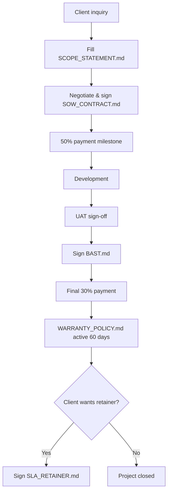

# Client Commercial Templates

**Use case**: Fixed-price client projects dengan legal protection

**Critical for**: Freelancers, agencies, contract developers

---

## Pre-Contract Phase

### 1. SCOPE_STATEMENT.md
**Path**: `../../01-discovery-commercial/SCOPE_STATEMENT_TEMPLATE.md`  
**Purpose**: MoSCoW prioritization, out-of-scope boundary  
**Time**: 1 hour  
**When**: Before contract negotiation

**Output**: `docs/pm/SCOPE_STATEMENT.md`

```bash
mkdir -p docs/pm
cp templates/01-discovery-commercial/SCOPE_STATEMENT_TEMPLATE.md docs/pm/SCOPE_STATEMENT.md
# List all Must-Have features + explicit Out-of-Scope items
```

**Why critical**: Prevents scope creep ("tapi kan cuma tambah button doang")

---

### 2. SOW_CONTRACT.md
**Path**: `../../01-discovery-commercial/SOW_CONTRACT_CONSOLIDATED_TEMPLATE.md`  
**Purpose**: Fixed-price contract, payment terms, legal protection  
**Time**: 2 hours  
**When**: After scope agreed, before development starts

**Output**: `contracts/SOW_CONTRACT.md`

```bash
mkdir -p contracts
cp templates/01-discovery-commercial/SOW_CONTRACT_CONSOLIDATED_TEMPLATE.md contracts/SOW_CONTRACT.md
# Fill: budget breakdown, payment milestones (30% down, 40% midpoint, 30% delivery)
```

**Key clauses**:
- **Scope limitation**: "Changes outside SCOPE_STATEMENT.md billed separately"
- **Payment schedule**: Milestone-based (never 100% upfront or 100% at end)
- **Acceptance criteria**: Objective metrics (not "client satisfaction")
- **IP ownership**: Code ownership transfer only after final payment
- **Warranty period**: 30-90 days bug fixes included

**Indonesian law compliance**: UU PDP Article 16 (data processing consent), Pasal 1338 KUHPerdata (contract binding force)

---

## Post-Delivery Phase

### 3. BAST.md (Berita Acara Serah Terima)
**Path**: `../../07-release-handover/BAST_TEMPLATE.md`  
**Purpose**: Legal handover document (final acceptance)  
**Time**: 30 minutes  
**When**: After UAT sign-off, before final payment

**Output**: `contracts/BAST.md`

```bash
cp templates/07-release-handover/BAST_TEMPLATE.md contracts/BAST.md
# Fill: deliverables checklist, client signature, warranty start date
```

**What to include**:
- ✅ URL live production
- ✅ Admin credentials
- ✅ Source code repository access
- ✅ Database backup
- ✅ API keys & environment variables
- ✅ Domain & hosting ownership transfer proof

**Legal significance**: BAST = proof of delivery → trigger final payment

---

### 4. WARRANTY_POLICY.md
**Path**: `../../08-maintenance-ops/WARRANTY_POLICY_TEMPLATE.md`  
**Purpose**: Post-launch support terms (bug fixes, not new features)  
**Time**: 30 minutes  
**When**: Before BAST signature

**Output**: `contracts/WARRANTY_POLICY.md`

```bash
cp templates/08-maintenance-ops/WARRANTY_POLICY_TEMPLATE.md contracts/WARRANTY_POLICY.md
# Define: warranty period (30-90 days), Severity 1-3 SLA, exclusions
```

**Standard terms**:
- **Period**: 60 days from BAST date
- **Coverage**: Bugs introduced by developer (not third-party APIs, infrastructure, user error)
- **SLA**:
  - Severity 1 (production down): 4-hour response, 24-hour fix
  - Severity 2 (feature broken): 24-hour response, 72-hour fix
  - Severity 3 (minor UI): Best-effort, no SLA
- **Exclusions**: New features, design changes, performance optimization (billed separately)

---

### 5. SLA_RETAINER.md
**Path**: `../../08-maintenance-ops/SLA_RETAINER_TEMPLATE.md`  
**Purpose**: Ongoing monthly support contract  
**Time**: 1 hour  
**When**: Optional, if client wants post-warranty support

**Output**: `contracts/SLA_RETAINER.md`

```bash
cp templates/08-maintenance-ops/SLA_RETAINER_TEMPLATE.md contracts/SLA_RETAINER.md
# Define: monthly hours (e.g., 20 hours/month), hourly rate, rollover policy
```

**Pricing models**:
1. **Hourly bucket**: Rp 10M/month for 20 hours (Rp 500K/hour)
2. **Fixed retainer**: Rp 5M/month unlimited bug fixes (no new features)
3. **Per-incident**: Rp 2M per bug fix (no monthly commitment)

**Recommendation**: Option 2 for stable products, Option 1 for evolving products

---

## Complete Client Flow



**Total time**: 4 hours documentation (vs 0 hours → legal nightmare)

---

## Risk Mitigation

**Without these templates**:
- ❌ Scope creep: "Tambah social login dong" (unpaid 8 hours work)
- ❌ Payment delay: Client stalls final payment 3+ months
- ❌ Ownership dispute: "I paid, give source code now" (before bug fixes)
- ❌ Infinite warranty: Client reports "bugs" 6 months later
- ❌ No legal recourse: No signed document if dispute escalates

**With these templates**:
- ✅ Scope locked: Changes = new SOW (billed separately)
- ✅ Milestone payments: 30% down + 40% mid + 30% delivery
- ✅ Code ownership: Transfer only after final payment (stated in SOW)
- ✅ Warranty expiry: 60 days from BAST (no perpetual support)
- ✅ Legal protection: Signed contracts admissible in court (Pasal 1338 KUHPerdata)

---

## Legal Review Checklist

Before signing SOW_CONTRACT.md:

- [ ] **Budget realistic**: 30% buffer for unknowns
- [ ] **Payment milestones**: Never 0% down or 100% at end
- [ ] **Acceptance criteria**: Objective (not "client likes it")
- [ ] **Scope boundary**: Out-of-Scope list explicit
- [ ] **IP ownership**: Transfer after full payment only
- [ ] **Warranty period**: 30-90 days standard (not perpetual)
- [ ] **Governing law**: Indonesian law (for Indonesian clients)
- [ ] **Dispute resolution**: Mediation before litigation

**Note**: Templates reviewed by Indonesian contract law standards. For high-value contracts (>Rp 100M), consult lawyer (see `audit/LEGAL_REVIEW_TODO.md`).

---

**See also**:
- `../technical-specs/` - For PRD/FSD templates
- `../mvp-fast-track/` - For internal projects (no SOW needed)
- `../../01-discovery-commercial/` - Full commercial phase templates
